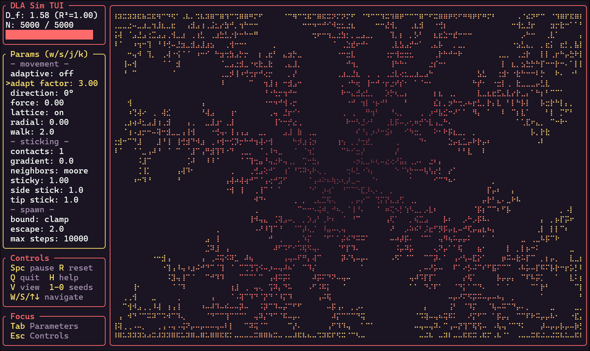

# DLA Sim TUI

  <div align="center">
          
      <br>
          <i>Example run with sunset theme</i>
    <br>
  </div>

<br>

A terminal-based Diffusion-Limited Aggregation (DLA) simulation using high-resolution Braille character rendering.

## Installation

### From GitHub (recommended)

```bash
# Install the latest version
cargo install --git https://github.com/jo56/dla-sim-tui

# Install a specific release
cargo install --git https://github.com/jo56/dla-sim-tui --tag v0.0.1
```

After installation, run directly:

```bash
dla-sim-tui
```

### From source

```bash
# Clone the repository
git clone https://github.com/jo56/dla-sim-tui.git
cd dla-sim-tui

# Build and run
cargo run --release
```

## Usage

```bash
# If installed via cargo install:
dla-sim-tui
dla-sim-tui --particles 3000 --stickiness 0.5 --seed circle --speed 10

# If running from source:
cargo run --release
cargo run --release -- --particles 3000 --stickiness 0.5 --seed circle --speed 10
```

### Command Line Options

#### Config & Presets

| Option | Description |
|--------|-------------|
| `--config <FILE>` | Load settings from a JSON config file. CLI args override config values. |
| `--preset <NAME>` | Load a preset by name (built-in or user-created). CLI args override preset values. |

#### Simulation Mode

| Option | Description |
|--------|-------------|
| `--classic` | Use classic Witten-Sander DLA defaults (unit lattice steps, 4-neighbor, absorb boundary). Without this flag, enhanced defaults optimized for visualization are used. |

#### Basic Options

| Option | Description | Default |
|--------|-------------|---------|
| `-p, --particles` | Number of particles (100-10000) | 5000 |
| `-s, --stickiness` | Base adhesion probability (0.1-1.0) | 1.0 |
| `--seed` | Seed pattern (point, line, cross, circle, ring, block, noise, scatter, multipoint, starburst) | point |
| `--speed` | Steps per frame (1-100) | 15 |

#### Movement Options

| Option | Description | Default |
|--------|-------------|---------|
| `--walk-step` | Distance per walk iteration (0.5-5.0) | 2.0 |
| `--walk-angle` | Bias direction in degrees (0-360) | 0.0 |
| `--walk-force` | Bias strength (0.0-0.5) | 0.0 |
| `--radial-bias` | Radial drift (-0.3 to 0.3, neg=out, pos=in) | 0.0 |

#### Sticking Options

| Option | Description | Default |
|--------|-------------|---------|
| `--neighborhood` | Neighbor check type (vonneumann, moore, extended) | moore |
| `--multi-contact` | Minimum neighbors to stick (1-4) | 1 |
| `--tip-stickiness` | Stickiness at branch tips (0.1-1.0) | 1.0 |
| `--side-stickiness` | Stickiness on branch sides (0.1-1.0) | 1.0 |
| `--stickiness-gradient` | Stickiness change per 100px (-0.5 to 0.5) | 0.0 |

#### Spawn & Boundary Options

| Option | Description | Default |
|--------|-------------|---------|
| `--spawn-mode` | Spawn location (circle, edges, corners, random, top, bottom, left, right) | circle |
| `--boundary` | Edge behavior (clamp, wrap, bounce, stick, absorb) | clamp |
| `--spawn-offset` | Buffer from structure (5-50) | 10.0 |
| `--escape-mult` | Escape distance multiplier (2.0-6.0) | 2.0 |
| `--min-radius` | Minimum spawn radius (20-100) | 50.0 |
| `--max-iterations` | Max walk steps before respawn (1000-50000) | 10000 |

#### Visual Options

| Option | Description | Default |
|--------|-------------|---------|
| `--color-mode` | Color property (age, distance, density, direction) | age |
| `--highlight` | Recent particles to highlight (0-50) | 0 |
| `--invert` | Invert color gradient | false |
| `-t, --theme` | Color theme (see Themes section below) | default |

### Examples

```bash
# Load a built-in preset
dla-sim-tui --preset Dendritic

# Load a preset and override some settings
dla-sim-tui --preset Coral --particles 8000 -t matrix

# Classic DLA with higher stickiness at tips (creates bushier growth)
dla-sim-tui --tip-stickiness 1.0 --side-stickiness 0.3

# Directional growth from top edge
dla-sim-tui --spawn-mode top --walk-angle 270 --walk-force 0.2

# Dense blob-like growth
dla-sim-tui --neighborhood extended --multi-contact 2

# Toroidal boundary with random spawning
dla-sim-tui --boundary wrap --spawn-mode random

# Color by approach direction with inverted gradient
dla-sim-tui --color-mode direction --invert

# Run with classic Witten-Sander DLA settings
dla-sim-tui --classic
```

### Default vs Classic Mode

The simulation offers two modes with different default parameters:

| Parameter | Default Mode | Classic Mode (`--classic`) |
|-----------|--------------|----------------------------|
| Walk Step | 2.0 | 1.0 (unit lattice) |
| Neighborhood | Moore (8) | Von Neumann (4) |
| Boundary | Clamp | Absorb (respawn) |
| Min Spawn Radius | 50.0 | 15.0 |
| Escape Multiplier | 2.0 | 3.0 |

**Default mode** is optimized for visual quality and faster growth, producing smoother, more natural-looking fractals.

**Classic mode** (`--classic`) follows the canonical Witten-Sander DLA algorithm more closely, suitable for studying fractal properties and producing the characteristic angular, dendritic patterns.

### Config Files

Export your current settings to a JSON file by pressing `Shift+X` while running. Load settings from a config file using `--config`:

```bash
# Load settings from a config file
dla-sim-tui --config my-settings.json

# CLI args override config file values
dla-sim-tui --config my-settings.json --particles 1000

# Export: While running, press Shift+X, enter filename, press Enter
```

Config files store all simulation parameters in JSON format and can be edited manually or shared with others.

### Recording

Capture your simulation as a video file:

1. Press `` ` `` (backtick) to open the recording dialog (simulation pauses)
2. Enter a filename (default: `dla_recording.mp4`)
3. Press `Enter` to start recording (simulation resumes)
4. Press `` ` `` again to stop and save the recording

**Supported formats:**

| Extension | Encoder | Notes |
|-----------|---------|-------|
| `.mp4` | FFmpeg (H.264) | Best quality, requires [FFmpeg](https://ffmpeg.org/) installed |
| `.webm` | FFmpeg (VP9) | Web-friendly, requires FFmpeg |
| `.gif` | Native Rust | No dependencies, 256 color limit |

If you request `.mp4` or `.webm` but FFmpeg isn't installed, the recording will automatically fall back to GIF format.

## Controls

### Navigation & System

| Key | Action |
|-----|--------|
| `Space` | Pause/Resume simulation |
| `R` | Reset simulation |
| `Tab` | Next parameter |
| `Shift+Tab` | Previous parameter |
| `w/s/Up/Down` | Navigate/Scroll |
| `j/k` | Adjust focused value |
| `Esc` | Close help / exit focus |
| `V` | Cycle view mode (Default/States/Fullscreen) |
| `Shift+X` | Export config to file |
| `H` | Show help (Up/Down to scroll) |
| `Q` | Quit |

### Quick Keys

| Key | Action |
|-----|--------|
| `1-0` | Quick select seed pattern (1=Point through 0=Scatter) |
| `+/-` | Adjust simulation speed |
| `[/]` | Adjust highlight count |
| `A` | Toggle color-by-age |
| `L` | Cycle min brightness (0%/15%/30%/45%) |
| `` ` `` | Start/stop recording |
| `Shift+L` | Load preset |
| `Shift+K` | Save preset |
| `Shift+S` | Open spawn mode popup |
| `Shift+W` | Increase walk step size |
| `Shift+E` | Decrease walk step size |
| `Shift+T` | Cycle theme (previous) |

### Parameter Popup

| Key | Action |
|-----|--------|
| `Shift+?` | Open popup with all parameters |
| `Shift+letter` | Open popup filtered to parameters starting with that letter |
| `Up/Down` | Navigate popup options |
| `Enter` | Select and focus parameter |
| `Esc` | Close popup |

### Direct Parameter Keys

| Key | Action |
|-----|--------|
| `C` | Cycle color scheme |
| `T` | Cycle theme (next) |
| `M` | Cycle color mode |
| `N` | Cycle neighborhood type |
| `B` | Cycle boundary behavior |
| `P` | Focus particles parameter |
| `I` | Invert colors |

### View Modes

Press `V` to cycle through view modes:

| Mode | Description |
|------|-------------|
| Default | Narrow sidebar (22 chars) + large canvas |
| States | Two-column params panel (48 chars) + smaller canvas - see all 27 parameters at once |
| Fullscreen | Canvas only, maximum visualization area |

## Parameters

The simulation has 27 adjustable parameters organized into four categories.

### Movement Parameters

Control how particles move during their random walk.

| Parameter | Range | Default | Description |
|-----------|-------|---------|-------------|
| Walk Step Size | 0.5-5.0 | 2.0 | Distance moved per step. Larger = faster but coarser patterns |
| Direction | 0-360° | 0 | Bias angle for directional drift |
| Force | 0-0.5 | 0 | Strength of directional bias (0 = isotropic random walk) |
| Radial Bias | -0.3 to 0.3 | 0 | Negative = outward drift, Positive = inward drift |
| Adaptive Step | on/off | off | When enabled, step size scales with distance from cluster (faster simulation) |
| Adaptive Factor | 1.0-10.0 | 3.0 | Maximum multiplier for adaptive step size |
| Lattice Walk | on/off | on | Use 4-direction cardinal movement (classic DLA) vs continuous angles |

### Sticking Parameters

Control when and how particles attach to the structure.

| Parameter | Range | Default | Description |
|-----------|-------|---------|-------------|
| Stickiness | 0.1-1.0 | 1.0 | Base probability of sticking on contact |
| Neighborhood | VonNeumann/Moore/Extended | Moore | How many neighbors are checked (4/8/24) |
| Multi-Contact | 1-4 | 1 | Minimum neighbors required to stick |
| Tip Stickiness | 0.1-1.0 | 1.0 | Stickiness at branch tips (few neighbors) |
| Side Stickiness | 0.1-1.0 | 1.0 | Stickiness on branch sides (many neighbors) |
| Stickiness Gradient | -0.5 to 0.5 | 0 | How stickiness changes with distance from center (per 100px) |

**Neighborhood Types:**
- **Von Neumann (4)**: Only orthogonal neighbors. Creates angular, cross-like patterns.
- **Moore (8)**: Orthogonal + diagonal. Natural fractal patterns (default).
- **Extended (24)**: 2-cell radius. Dense, blob-like growth.

### Spawn & Boundary Parameters

Control where particles appear and how edges are handled.

| Parameter | Range | Default | Description |
|-----------|-------|---------|-------------|
| Spawn Mode | 8 options | Circle | Where new particles originate |
| Boundary | 5 options | Clamp | What happens at grid edges |
| Spawn Offset | 5-50 | 10 | Buffer distance between structure and spawn circle |
| Escape Mult | 2.0-6.0 | 2.0 | Multiplier for escape/respawn distance |
| Min Radius | 20-100 | 50 | Minimum spawn radius |
| Max Iterations | 1000-50000 | 10000 | Steps before particle respawns |

**Spawn Modes:**
- **Circle**: Classic DLA - spawn on a circle around the structure
- **Edges**: Spawn from all four grid edges
- **Corners**: Spawn only from corners
- **Random**: Spawn at random positions outside structure
- **Top/Bottom/Left/Right**: Directional spawning from a single edge

**Boundary Behaviors:**
- **Clamp**: Particles stop at edges (default)
- **Wrap**: Particles wrap to opposite side (toroidal)
- **Bounce**: Particles reflect off edges
- **Stick**: Particles can stick to edges themselves
- **Absorb**: Particles are removed and respawned at edges

### Visual Parameters

Control how the simulation is displayed.

| Parameter | Range | Default | Description |
|-----------|-------|---------|-------------|
| Particles | 100-10000 | 5000 | Total number of particles |
| Speed | 1-100 | 5 | Simulation steps per frame |
| Color Scheme | 16 options | Ice | Color gradient |
| Color Mode | Age/Distance/Density/Direction | Age | What property determines color |
| Color by Age | on/off | on | Enable color gradient |
| Invert | on/off | off | Invert color gradient |
| Highlight | 0-50 | 0 | Recent particles shown in white |

**Color Modes:**
- **Age**: Color based on attachment order (oldest to newest)
- **Distance**: Color based on distance from center
- **Density**: Color based on neighbor count when stuck
- **Direction**: Color based on approach angle when stuck

### Themes

12 color themes are available, each with matching UI colors and particle gradients. The default theme uses a transparent background (inherits your terminal's colors); other themes use solid backgrounds. Use `--theme <name>` or press `T` to cycle.

| Theme | Description | CLI Name |
|-------|-------------|----------|
| **Default** | Grayscale + gold, transparent background | `default` |
| **Lagoon** | Teal/gold coastal theme | `lagoon` |
| **Bluemono** | Light theme, black/blue on white | `bluemono` |
| **Violet** | Purple/pink gradient | `violet` |
| **Harvest** | Earthy orange/yellow | `harvest` |
| **Midnight** | Deep blue night sky | `midnight` |
| **Rainbow** | Pastel purple/pink plasma | `rainbow` |
| **Frost** | Icy cyan/white | `frost` |
| **Deep Space** | Neon on dark blue | `deep-space` |
| **Sunset** | Warm red/orange/yellow | `sunset` |
| **Matrix** | Green terminal aesthetic | `matrix` |
| **Amber** | Amber monochrome | `amber` |

Example usage:
```bash
dla-sim-tui --theme violet
dla-sim-tui --theme lagoon
dla-sim-tui --theme matrix
```

### Seed Patterns

Press number keys 1-0 to quickly select:

| Key | Pattern | Description |
|-----|---------|-------------|
| 1 | Point | Single center particle - classic DLA growth |
| 2 | Line | Horizontal line - symmetrical branching |
| 3 | Cross | Cross pattern - four-way growth |
| 4 | Circle | Ring of particles - inward/outward growth |
| 5 | Ring | Thick rim with hollow core - outside-in branching |
| 6 | Block | Solid square - surface roughening |
| 7 | Multi-Point | Multiple competing centers |
| 8 | Starburst | Radial spokes with rim - strong anisotropy |
| 9 | Noise Patch | Dense noisy blob - asymmetric drift |
| 0 | Scatter | Randomized small seeds near center |

### Presets

Presets allow you to quickly save and load simulation configurations.

**Loading presets:** Press `Shift+L` to open the preset loader. Use Up/Down to navigate, Enter to load, Esc to cancel.

**Saving presets:** Press `Shift+K` to save your current settings as a new preset. Enter a name and press Enter.

12 built-in presets provide quick access to interesting configurations:

| Preset | Description |
|--------|-------------|
| Classic | Standard DLA with default settings |
| Dense | Compact structures with multiple contact requirement |
| Dendritic | Thin, branching dendrite patterns |
| Snowflake | Symmetric snowflake-like growth |
| Coral | Thick, coral-like structures |
| Wind-swept | Asymmetric growth with directional bias |
| Fractal Forest | Multiple growth centers competing |
| Edge Growth | Particles spawn from grid edges |
| Angular | Sharp, angular growth patterns |
| Blob | Dense, blob-like structures |
| Gradient | Dense core with sparse edges |
| Rain | Particles fall from top edge |

#### Preset File Location

User-created presets are saved as individual JSON files. You can manually add, edit, or delete preset files:

| Platform | Location |
|----------|----------|
| Linux | `~/.config/dla-sim-tui/presets/` |
| macOS | `~/Library/Application Support/dla-sim-tui/presets/` |
| Windows | `C:\Users\<username>\AppData\Roaming\dla-sim-tui\presets\` |

Each preset is a standalone `.json` file that can be shared or backed up.

## Dependencies

- [ratatui](https://github.com/ratatui/ratatui) - Terminal UI framework
- [crossterm](https://github.com/crossterm-rs/crossterm) - Cross-platform terminal manipulation
- [rand](https://github.com/rust-random/rand) - Random number generation
- [clap](https://github.com/clap-rs/clap) - Command line argument parsing
- [serde](https://github.com/serde-rs/serde) - Serialization framework
- [dirs](https://github.com/dirs-dev/dirs-rs) - Platform directory paths
- [image](https://github.com/image-rs/image) - Image processing for video frames
- [gif](https://github.com/image-rs/image-gif) - GIF encoding

## License

MIT
